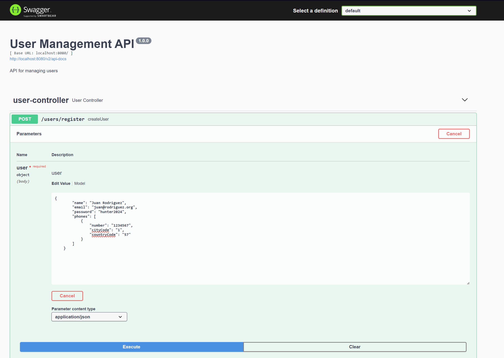

# Documento para probar el servicio

### 1. Para probar a travez de Swagger UI se debe acceder a la siguiente url: http://localhost:8080/swagger-ui.html

### Presionar el boton "Try it out"

### y luego ingresar el json de entrada como por ejemplo el siguiente:

    {
        "name": "Juan Rodriguez",
        "email": "juan@rodriguez.org",
        "password": "hunter2024",
        "phones": [
            {
                "number": "1234567",
                "cityCode": "1",
                "countryCode": "57"
            }
        ]
    }

### Luego presionar el boton "Execute"

### 2. Para probar a travez de Postman se debe acceder a la siguiente url: http://localhost:8080/users/register

### y luego ingresar el json de entrada como por ejemplo el siguiente:

    {
        "name": "Juan Rodriguez",
        "email": "juan@rodriguez.org",
        "password": "hunter2024",
        "phones": [
            {
                "number": "1234567",
                "cityCode": "1",
                "countryCode": "57"
            }
        ]
    }

### Luego presionar el boton "Send"

